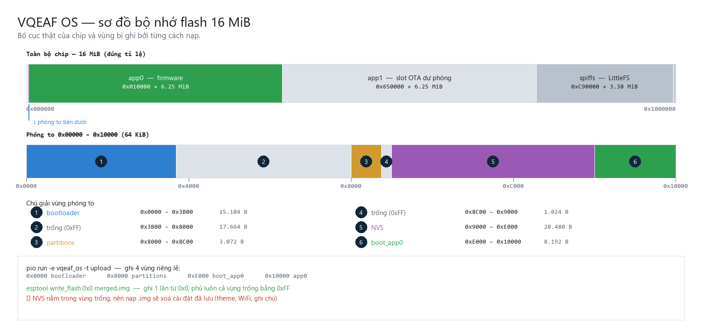
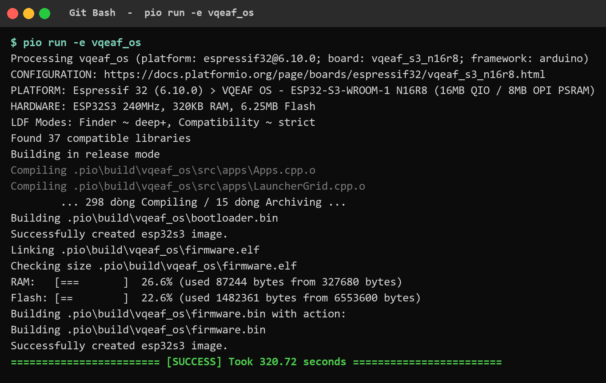
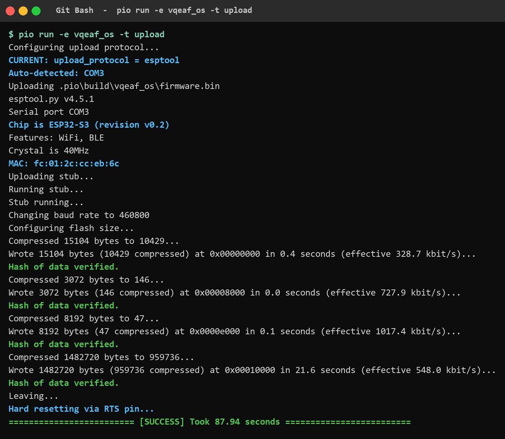
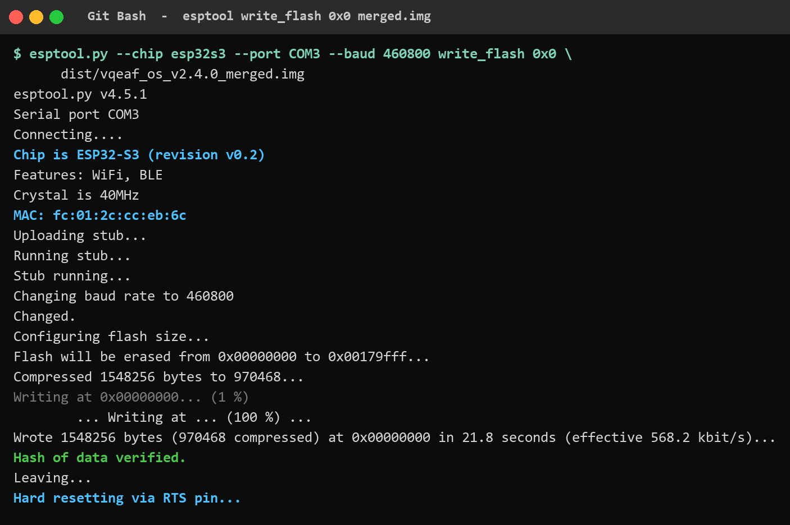
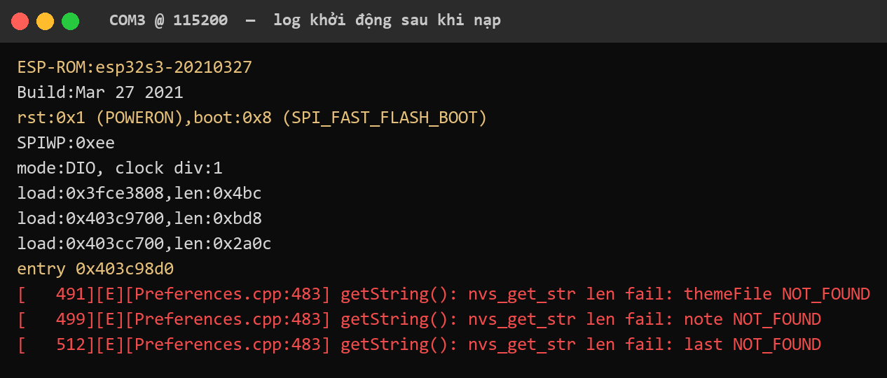

# Hướng dẫn nạp firmware VQEAF OS

Tài liệu này mô tả **hai cách nạp firmware lên board ESP32-S3 N16R8**: nạp tệp
`.bin` bằng PlatformIO, và nạp tệp `.img` gộp bằng `esptool`.

Mọi hình ảnh trong tài liệu này được render **từ log thật** của các lần chạy thực
tế trên board (chip `ESP32-S3 rev v0.2`, MAC `fc:01:2c:cc:eb:6c`, cổng `COM3`),
với firmware **v2.4.0**. Log gốc lưu ở [`logs/`](logs/) để đối chiếu. Nhiễu do
sandbox của công cụ chạy (`[safe-delete]`, traceback của `sitecustomize.py`) đã
được lọc bỏ bằng `tools/_clean_pio_log.py` — phần còn lại nguyên văn.

---

## 1. Hiểu bố cục bộ nhớ trước khi nạp

Nạp sai offset là nguyên nhân phổ biến nhất khiến board không khởi động. Sơ đồ
dưới đây là bố cục thật của chip, lấy từ `partitions/vqeaf_16mb_ota.csv`:



Bốn vùng cần ghi:

| Offset | Tệp | Kích thước | Vai trò |
|---|---:|---:|---|
| `0x00000000` | `bootloader.bin` | 15.104 B | Chương trình nạp của ROM |
| `0x00008000` | `partitions.bin` | 3.072 B | Bảng phân vùng |
| `0x0000e000` | `boot_app0.bin` | 8.192 B | Chọn slot OTA để khởi động |
| `0x00010000` | `firmware.bin` | 1.482.720 B | Ứng dụng VQEAF OS |

Vùng `app0` rộng 6,25 MiB (`0x640000` byte). `firmware.bin` chiếm 22,6 % vùng đó.

> **Lưu ý quan trọng:** `NVS` (`0x9000`) nằm trong khoảng trống giữa
> `partitions.bin` và `boot_app0.bin`. Khi nạp tệp `.img`, khoảng trống này bị
> ghi đè bằng `0xFF` — nghĩa là **cài đặt đã lưu sẽ bị xoá**. Xem mục 4.

---

## 2. Chuẩn bị

**Phần cứng**

- Board ESP32-S3-WROOM-1 **N16R8** (16 MiB flash QIO + 8 MiB PSRAM OPI).
- Cáp USB **truyền dữ liệu** (cáp chỉ sạc sẽ không thấy cổng COM).
- Màn hình ST7789 240×320 dọc, đấu theo `include/BoardConfig.h`.

**Phần mềm**

```bash
pio --version          # cần PlatformIO Core 6.x
```

`esptool` đi kèm PlatformIO tại
`~/.platformio/packages/tool-esptoolpy/esptool.py` — không cần cài riêng.

**Xác định cổng nối**

```bash
pio device list
```

Kết quả trên board đang dùng:

```
COM3
----
Hardware ID: USB VID:PID=1A86:7523
Description: USB-SERIAL CH340 (COM3)
```

> **Hai cổng USB trên board.** Board có cổng `UART` (qua chip CH340 → `COM3`) và
> cổng `USB` native (GPIO19/20). **Nạp firmware thì dùng cổng `UART`/COM3.**
> Nhưng log ứng dụng (`[VQEAF][BUILD]`, `[VQEAF][MEM]`, `SD: mounted`) lại đi ra
> **cổng USB native**, không ra COM3 — xem mục 5.

---

## 3. Cách A — nạp tệp `.bin` bằng PlatformIO

Đây là cách dùng hằng ngày: PlatformIO tự build rồi tự ghi đúng 4 offset.

### 3.1. Build

```bash
pio run -e vqeaf_os
```



Kết quả mong đợi:

- `298 dòng Compiling` + `15 dòng Archiving` (build sạch từ đầu, khoảng **321 giây**).
- `Linking .pio/build/vqeaf_os/firmware.elf`
- `RAM: 26.6% (used 87244 bytes from 327680 bytes)`
- `Flash: 22.6% (used 1482361 bytes from 6553600 bytes)`
- Kết thúc bằng `[SUCCESS]`.

Sinh ra `.pio/build/vqeaf_os/firmware.bin` (1.482.720 B) và `firmware.elf`.

> **Đừng tin chữ `[SUCCESS]` một cách mù quáng.** Nếu log có dòng
> `Can not remove temporary directory .pio\build`, nghĩa là build **không làm gì
> cả** dựa trên DB cũ, và `firmware.bin` có thể không tồn tại. Cách chắc chắn:

```bash
ls -la .pio/build/vqeaf_os/firmware.bin
```

Nếu thiếu, xoá cache build rồi làm lại (giữ `.pio/libdeps` để khỏi tải lại thư viện):

```bash
rm -rf .pio/build && pio run -e vqeaf_os
```

### 3.2. Nạp

```bash
pio run -e vqeaf_os -t upload
```



Bốn lần ghi riêng biệt, mỗi lần đều có `Hash of data verified.`:

```
Wrote   15104 bytes ( 10429 compressed) at 0x00000000 ...
Wrote    3072 bytes (   146 compressed) at 0x00008000 ...
Wrote    8192 bytes (    47 compressed) at 0x0000e000 ...
Wrote 1482720 bytes (959736 compressed) at 0x00010000 ...
```

Kết thúc bằng `Hard resetting via RTS pin...` — board tự khởi động lại.

---

## 4. Cách B — nạp tệp `.img` gộp

`.img` là ảnh gộp cả 4 vùng vào một tệp, nạp **một lần duy nhất từ `0x0`**. Phù
hợp để phát hành cho người khác, hoặc nạp lại board về trạng thái sạch.

### 4.1. Tạo tệp `.img`

```bash
python tools/make_flash_image.py
```

Script đọc kết quả build, gộp 4 vùng bằng `esptool merge_bin`, rồi **tự kiểm tra
lại chính nó** (so từng byte với tệp nguồn + kiểm magic byte). Xuất ra `dist/`:

| Tệp | Kích thước | Dùng khi |
|---|---:|---|
| `vqeaf_os_v2.4.0_merged.img` | 1.548.256 B | Bản chuẩn, nạp ở `0x0` |
| `vqeaf_os_v2.4.0_16mb.img` | 16.777.216 B | Tool nào bắt buộc ảnh đủ dung lượng chip |

SHA-256:

```
81fbb720ff5ff8a4d1919d75b27e9f81ef2a08d5a6ace673c86075dcee71ac52  vqeaf_os_v2.4.0_merged.img
3801fdfb8e1da7be34300f3ba8b78ad0b4ff55ff99d7ab80462accaae4b3dddb  vqeaf_os_v2.4.0_16mb.img
```

`merged.img` = `0x10000` (64 KiB header vùng) + `firmware.bin`, đúng bằng
`65.536 + 1.482.720 = 1.548.256` byte.

### 4.2. Nạp

```bash
esptool.py --chip esp32s3 --port COM3 --baud 460800 \
  write_flash 0x0 dist/vqeaf_os_v2.4.0_merged.img
```



Kết quả mong đợi:

```
Flash will be erased from 0x00000000 to 0x00179fff...
Wrote 1548256 bytes (970468 compressed) at 0x00000000 in 21.8 seconds ...
Hash of data verified.
Hard resetting via RTS pin...
```

Dòng `Flash will be erased ... to 0x00179fff` chính là bằng chứng cho cảnh báo
bên dưới: vùng xoá trùm qua `0x9000`, tức là trùm qua `NVS`.

Nếu `esptool` không có trên PATH, gọi trực tiếp bản của PlatformIO:

```bash
python ~/.platformio/packages/tool-esptoolpy/esptool.py --chip esp32s3 \
  --port COM3 --baud 460800 write_flash 0x0 dist/vqeaf_os_v2.4.0_merged.img
```

> ### ⚠️ Nạp `.img` sẽ xoá cài đặt đã lưu
>
> Ảnh `.img` lấp mọi khoảng trống bằng `0xFF`, kể cả vùng `NVS` ở `0x9000`. Hệ quả:
> **theme đang chọn, hồ sơ WiFi, ghi chú đều mất.** Đây là hành vi bình thường của
> ảnh factory/clean, nhưng phải biết trước. Nếu muốn giữ cài đặt, dùng cách A
> (`.bin`) — cách đó chỉ ghi 4 vùng, không đụng tới NVS.

---

## 5. Kiểm tra sau khi nạp

Mở cổng COM3 ở 115200 và reset board (nhấn nút RESET, hoặc rút/cắm lại cáp):

```bash
pio device monitor -b 115200 -p COM3
```

Bất kỳ terminal serial nào (PuTTY, minicom, `pyserial`) cũng dùng được, miễn đúng
115200 8N1. Nhấn `Ctrl+]` để thoát `pio device monitor`.



Dấu hiệu board chạy đúng:

- `ESP-ROM:esp32s3-20210327` và `rst:0x1 (POWERON),boot:0x8 (SPI_FAST_FLASH_BOOT)`
- `entry 0x403c98d0` — **điểm vào này phải khớp** với `Entry point` mà
  `esptool image_info` báo trên **`bootloader.bin`** (hoặc trên `merged.img`, vì
  ảnh gộp bắt đầu bằng bootloader). Khớp nhau nghĩa là ảnh đúng là firmware
  đang chạy.
- **Không có** panic dump (`Guru Meditation`, `Backtrace`, `Brownout`).

> **Cẩn thận khi kiểm tra `Entry point`.** Banner ROM in `entry` của
> **bootloader** (khối thứ hai ROM nạp), *không phải* của ứng dụng. Trên build
> v2.4.0 này:
>
> | Tệp | `Entry point` |
> |---|---|
> | `bootloader.bin` / `merged.img` | `403c98d0` ← khớp banner ROM |
> | `firmware.bin` (ứng dụng) | `40377588` ← **khác**, và điều đó là đúng |
>
> Chạy `image_info` trên `firmware.bin` rồi so với banner ROM sẽ thấy lệch và dễ
> kết luận sai là "nạp hỏng". Đối chiếu đúng là `bootloader.bin`.

### Vì sao không thấy `[VQEAF][BUILD]` trên COM3?

`platformio.ini` bật `ARDUINO_USB_MODE=1` + `ARDUINO_USB_CDC_ON_BOOT=1`, nên:

```c
// cores/esp32/HWCDC.h
extern HWCDC Serial;            // Serial = USB native (GPIO19/20)
// cores/esp32/HardwareSerial.h
extern HardwareSerial Serial0;  // UART0 (CH340/COM3) chỉ là Serial0
```

Toàn bộ `src/main.cpp` ghi log qua `Serial`, nên `[VQEAF][BUILD]`, `[VQEAF][MEM]`,
`SD: mounted`, `[S3DIAG][BOOT]` **chỉ hiện khi cắm cổng USB native**, không hiện
trên COM3. Muốn xem chúng, cắm thêm cáp vào cổng `USB` của board và mở cổng COM
mới xuất hiện.

COM3 vẫn hữu ích: nó mang ROM banner, log `ESP_LOGx` của core, và **panic dump**.
Im lặng sau banner nghĩa là *không crash*, không phải *không chạy*.

### Ba dòng `[E][Preferences.cpp] ... NOT_FOUND` là bình thường

```
[   491][E][Preferences.cpp:483] getString(): nvs_get_str len fail: themeFile NOT_FOUND
[   499][E][Preferences.cpp:483] getString(): nvs_get_str len fail: note NOT_FOUND
[   512][E][Preferences.cpp:483] getString(): nvs_get_str len fail: last NOT_FOUND
```

Đây là NVS còn trống (lần đầu khởi động, hoặc vừa nạp `.img` xong). Không phải lỗi.

Ba dòng này cũng là **bằng chứng ứng dụng đã chạy**, không chỉ bootloader: chúng
phát ra từ `SettingsStore::load()` (`src/services/SettingsStore.cpp`) và
`WiFiProfileStore` — tức là code ứng dụng, ở mốc ~0,5 giây sau khi reset.

### Lỗi khởi tạo thẻ SD (`0x107`) — quan sát được, không lặp lại

Lần khởi động **đầu tiên ngay sau khi nạp** có thể in ra:

```
E (925) sdmmc_common: sdmmc_init_ocr: send_op_cond (1) returned 0x107
E (925) vfs_fat_sdmmc: sdmmc_card_init failed (0x107).
[  1206][E][SD_MMC.cpp:148] begin(): Failed to initialize the card (0x107)...
```

`0x107` là `ESP_ERR_TIMEOUT`: thẻ chưa kịp trả lời `send_op_cond`. Trên board này
lỗi đó xuất hiện ở lần boot đầu sau khi nạp, rồi **không tái hiện** ở 5 lần boot
sau đó (log `boot_after_img.log` và 3 lần đo lại đều giống nhau từng byte, không
có dòng `sdmmc` nào). Vì `StorageService::begin()` luôn gọi `SD_MMC.begin()`, việc
vắng mặt các dòng đó nghĩa là thẻ **mount thành công**, không phải code bị bỏ qua.

Kết luận: đây là vấn đề **thời điểm tiếp xúc/ổn định nguồn của thẻ**, không phải
lỗi firmware. Nếu gặp lại thường xuyên, kiểm tra thẻ và điện trở kéo lên trên
đường SD; `StorageService::tick()` sẽ tự thử lại mỗi 15 giây.

---

## 6. So sánh hai cách

| | Cách A — `.bin` | Cách B — `.img` |
|---|---|---|
| Lệnh | `pio run -t upload` | `esptool write_flash 0x0` |
| Số lần ghi | 4 vùng riêng lẻ | 1 lần từ `0x0` |
| Cần build trước | Có | Không (dùng tệp có sẵn) |
| Ảnh hưởng NVS | Không | **Xoá sạch** |
| Dùng khi | Phát triển hằng ngày | Phát hành, nạp board mới |

---

## 7. Xử lý sự cố

| Hiện tượng | Nguyên nhân | Cách xử lý |
|---|---|---|
| `Failed to connect to ESP32-S3` | Board không vào chế độ nạp | Giữ nút **BOOT**, nhấn nhả **RESET**, rồi thả BOOT; hoặc kiểm tra cáp |
| Không thấy cổng COM nào | Cáp chỉ sạc, hoặc thiếu driver CH340 | Đổi cáp; cài driver CH340 |
| `Hash of data verified` báo sai | Nhiễu đường truyền | Hạ tốc độ: thêm `--baud 115200` |
| `fatal error: FS.h: No such file` | LDF không giải được `#include` trong khối `#ifdef` | **Không xoá** `-D SOC_SDMMC_HOST_SUPPORTED=1` trong `platformio.ini` |
| `[SUCCESS]` nhưng không có `firmware.bin` | `.pio/build` không xoá được, SCons dùng DB cũ | `rm -rf .pio/build` rồi build lại |
| Board khởi động nhưng màn hình trắng/đen | Vấn đề SPI/TFT, không phải nạp | Kiểm tra `TFT_BL` GPIO39 và dây SPI; xem `docs/BOARD_BUILD_V233.md` |
| `GetOverlappedResult failed (Access is denied)` | Cổng đang bị giữ, hoặc lỗi tạm thời của driver | Đóng mọi terminal serial đang mở; thử lại |

---

## 8. Tham chiếu nhanh

```bash
# build
pio run -e vqeaf_os

# nạp .bin
pio run -e vqeaf_os -t upload

# tạo .img
python tools/make_flash_image.py

# nạp .img
esptool.py --chip esp32s3 --port COM3 --baud 460800 \
  write_flash 0x0 dist/vqeaf_os_v2.4.0_merged.img

# kiểm tra cấu trúc .img (không cần board)
esptool.py --chip esp32s3 image_info dist/vqeaf_os_v2.4.0_merged.img

# đối chiếu điểm vào với banner ROM (phải là 403c98d0)
esptool.py --chip esp32s3 image_info .pio/build/vqeaf_os/bootloader.bin

# xem cổng
pio device list
```

**Thông số board đang dùng:** ESP32-S3 rev v0.2 · MAC `fc:01:2c:cc:eb:6c` ·
COM3 (CH340, `VID:PID=1A86:7523`) · tốc độ nạp 460800 · flash 16 MiB · PSRAM 8 MiB.

**Tệp liên quan**

- `tools/make_flash_image.py` — đóng gói `.img`
- `tools/render_terminal_png.py` — render log thành ảnh
- `tools/make_flash_guide_images.py` — sinh toàn bộ ảnh trong tài liệu này
- `tools/_clean_pio_log.py` — lọc nhiễu sandbox khỏi log trước khi lưu trữ
- `tools/_capture_boot_v240.py` — đọc UART0 sau khi reset để kiểm tra khởi động
- `logs/` — log thật của các lần chạy
- `docs/BOARD_BUILD_V233.md` — chi tiết board, phân vùng, chân GPIO

**Phiên bản tài liệu này mô tả:** VQEAF OS **v2.4.0**. Số liệu, log và ảnh đều
lấy từ lần build + nạp + khởi động thật trên board v2.4.0 (298 dòng Compiling,
`firmware.bin` 1.482.720 B).
